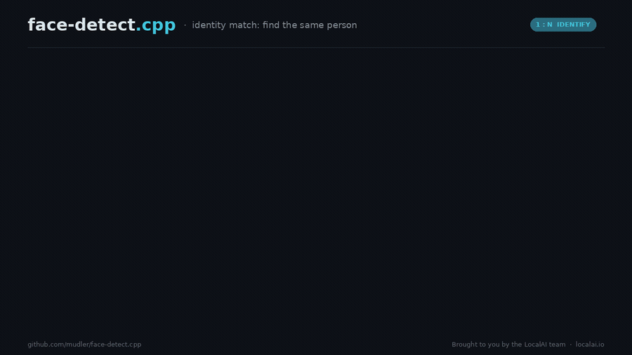
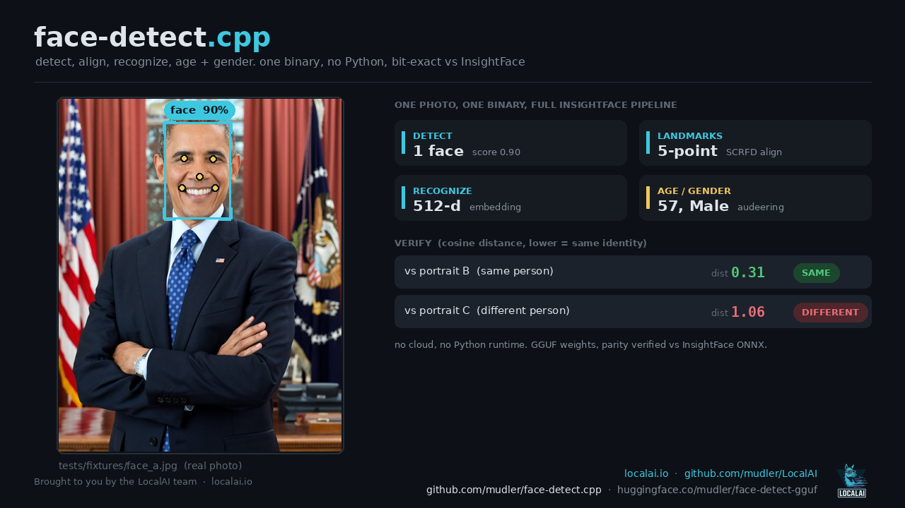

# face-detect.cpp

**Brought to you by the [LocalAI](https://github.com/mudler/LocalAI) team**, the folks behind LocalAI, the open-source AI engine that runs any model (LLMs, vision, voice, image, video) on any hardware, no GPU required.

[](https://huggingface.co/mudler/face-detect-gguf)
[](LICENSE)
[](https://github.com/mudler/LocalAI)

face-detect.cpp is a from-scratch C++17 port of the [insightface](https://github.com/deepinsight/insightface) buffalo face-recognition pipeline, built on [ggml](https://github.com/ggml-org/ggml). It runs the full chain (SCRFD detection, 5-landmark similarity-transform alignment to 112x112, ArcFace embedding) from a single self-contained GGUF file, with no Python, no PyTorch, and no onnxruntime at inference time. The honest headline is not raw CPU speed (on CPU it trails onnxruntime's MLAS conv kernels, and we say so below): it is simplicity, breadth, and bit-exact parity. One small `libfacedetect.so` does detect, align, recognize, age/gender, anti-spoof, and dense landmarks across six model packs, with detector boxes and landmarks matching insightface to within 1 px and the recognition embedding matching to cosine 1.000000. It is the native replacement for LocalAI's Python `insightface` backend, consumed through a flat C ABI (`include/facedetect_capi.h`) via purego / dlopen.



Face recognition, not just face detection: a probe face against a lineup, and the engine finds the same person by real ArcFace cosine distance (the true match here at 0.31, every other candidate well above the 0.35 threshold), all from one self-contained binary with no Python ([full clip](benchmarks/media/face_identity.mp4), [square version for social](benchmarks/media/face_identity_square.mp4)).

It runs the whole pipeline too. Here is the full detect, align, recognize, and age and gender chain as a live reel across a set of faces ([full clip](benchmarks/media/face_carousel.mp4), [square](benchmarks/media/face_carousel_square.mp4)):


The full per-face output on a single photo:

<p align="center">
  
</p>

Everything above comes out of the one engine. `detect` returns face boxes with a detector score plus the 5 SCRFD keypoints; `embed` returns the L2-normalized recognition vector (512-d ArcFace, or 128-d for the Apache SFace recognizer); `verify` returns the cosine distance between two faces with a match decision against a threshold, optionally gated by the MiniFASNet anti-spoof veto; `analyze` returns the genderage head's age and gender; and `landmarks` returns the dense 2D 106-point or 3D 68-point sets (engine-only for now, see the note below). The pipeline reproduces insightface's `norm_crop` similarity transform exactly, so the aligned 112x112 crop and the embedding it feeds are bit-for-bit what insightface produces.

> An alternative cut for socials runs the same pipeline on 10 famous public-domain paintings (the Mona Lisa, Vermeer, Van Gogh, the Laughing Cavalier and more): [gif](benchmarks/media/face_carousel_paintings.gif), [square](benchmarks/media/face_carousel_paintings_square.mp4), renderer + provenance in [benchmarks/demo/paintings](benchmarks/demo/paintings).

---

## Supported models

Every pack below is parity-verified against insightface / OpenCV-zoo (detector boxes and landmarks within 1 px, recognition embedding cosine >= 0.9999) and published as GGUF (f16, q8_0) in the single collection repo [mudler/face-detect-gguf](https://huggingface.co/mudler/face-detect-gguf). All six are in the LocalAI model gallery as `face-detect` entries. Convert any pack yourself with `scripts/convert_facedetect_to_gguf.py`.

| Pack | Detector | Recognizer | Dim | License | Notes |
|------|----------|------------|----:|---------|-------|
| `buffalo_l` | SCRFD (det_10g) | ArcFace ResNet50 | 512 | non-commercial | primary target |
| `buffalo_m` | SCRFD | ArcFace ResNet50 | 512 | non-commercial | |
| `buffalo_s` | SCRFD | ArcFace ResNet50 | 512 | non-commercial | smallest buffalo |
| `buffalo_sc` | SCRFD (det_500m) | MobileFaceNet (w600k_mbf) | 512 | non-commercial | detect + recognize only |
| `antelopev2` | SCRFD (det_10g) | ArcFace ResNet100 (glint360k) | 512 | non-commercial | highest accuracy |
| `yunet-sface` | YuNet | SFace | 128 | Apache-2.0 | commercial-friendly alternative |

On top of the recognition packs, the engine also runs the insightface **genderage** head (age + gender) and the **MiniFASNet anti-spoof** ensemble (V2@2.7 + V1SE@4.0, 80x80, used as a veto in `verify --anti-spoof`).

A licensing note worth reading before you ship: the insightface buffalo packs (`buffalo_*`, `antelopev2`) are released under a **non-commercial** license. The OpenCV-zoo **YuNet + SFace** pair (`yunet-sface`) is **Apache-2.0**, so it is the commercial-friendly detector + recognizer. Pick the pack that matches your use.

---

## Use it from LocalAI

face-detect.cpp is the native face backend for [LocalAI](https://github.com/mudler/LocalAI). Install any of the six packs straight from the model gallery (they appear as `face-detect` entries), and LocalAI pulls the GGUF and the backend for you:

```sh
local-ai models install face-detect-buffalo-l
```

Or reference the backend by name in a model config:

```yaml
backend: face-detect
```

LocalAI dlopens `libfacedetect.so` through purego and calls the flat C ABI directly, so there is no Python `insightface` process and no onnxruntime in the serving path.

---

## Performance

The honest summary first: on **CPU**, face-detect.cpp is **not** faster than onnxruntime. On the conv-heavy detector and recognizer, onnxruntime's MLAS kernels win. Measured on a Ryzen 9 9950X3D (parity-gated, ratio is ggml throughput over onnxruntime-CPU/MLAS), SCRFD detect runs at about **0.83x at 1 thread and 0.69x at 8 threads**, and ArcFace embed at about **0.61x at 1 thread and 0.84x at 8 threads**: onnxruntime is faster in every one of those. MLAS conv sits at the FMA-port peak and a custom AVX2 Winograd F(2x2,3x3) path narrows the gap but does not close it on small and mid feature maps. We do not claim a CPU speed win. Full methodology, the per-mode tables, the thread-scaling study, and the dead-ends are in [benchmarks/RESULTS.md](benchmarks/RESULTS.md).

What you get instead, and why the port is worth it:

- **One self-contained `libfacedetect.so`.** No Python, no onnxruntime, ggml linked statically and libjpeg-turbo vendored, so the shared object is `ldd`-clean.
- **Bit-exact parity.** Detector boxes and landmarks within 1 px, recognition embedding cosine 1.000000 versus insightface, held at any thread count.
- **Breadth in one engine.** Detect, 5-point keypoints, `norm_crop` align, recognize, age/gender, anti-spoof, and dense landmarks, across six packs including the Apache-2.0 YuNet + SFace.
- **Small and portable.** GGUF f16 / q8_0 weights, running on CPU and any ggml GPU backend (CUDA, Metal, Vulkan, HIP).
- **A real multi-thread win out of the box.** The library used to default to 1 thread; it now defaults to `min(hardware_concurrency, 8)`, which cuts absolute latency about 3.2x to 3.9x for any consumer that did not set threads (parity unchanged).

On **GPU**, the story is parity, not a deficit. With the ggml CUDA backend and cuDNN implicit-GEMM conv (`-DFACEDETECT_GGML_CUDNN=ON`) on an NVIDIA GB10 (Grace-Blackwell), SCRFD detect goes from 14.8 ms (ggml im2col) to 6.4 ms (cuDNN), about **2.3x**, landing at torch-cuDNN parity (about 5.8 ms), and ArcFace reaches parity as well. The point: on GPU, face-detect.cpp matches insightface's own cuDNN kernels, because it routes the same convs through cuDNN, in one self-contained binary with no Python. The GPU details and the like-for-like same-GPU comparison are in [benchmarks/RESULTS.md](benchmarks/RESULTS.md).

---

## Build

Requires CMake >= 3.18, a C++17 compiler, and the vendored ggml submodule.

```bash
git clone --recursive https://github.com/mudler/face-detect.cpp
cd face-detect.cpp
cmake -B build -DFACEDETECT_BUILD_CLI=ON
cmake --build build -j
```

If you forgot `--recursive`: `git submodule update --init --recursive`.

For the shared library (LocalAI / dlopen):

```bash
cmake -B build-shared -DFACEDETECT_SHARED=ON -DFACEDETECT_BUILD_CLI=ON
cmake --build build-shared -j
# -> build-shared/libfacedetect.so
```

`GGML_NATIVE` and `GGML_LLAMAFILE` are forced ON for free speedups unless you override them (e.g. `-DGGML_NATIVE=OFF` for portable or CI builds).

### CMake options

| Option | Default | Meaning |
|--------|---------|---------|
| `FACEDETECT_BUILD_CLI` | ON | build the `facedetect-cli` tool |
| `FACEDETECT_BUILD_TESTS` | OFF | build the ctest targets |
| `FACEDETECT_SHARED` | OFF | build `libfacedetect` as a shared lib (C-API) |
| `FACEDETECT_VENDOR_LIBJPEG` | ON | vendor + static-link libjpeg-turbo |
| `FACEDETECT_GGML_CUDA` | OFF | forward `GGML_CUDA` (NVIDIA) |
| `FACEDETECT_GGML_CUDNN` | OFF | use cuDNN implicit-GEMM conv on CUDA (requires `FACEDETECT_GGML_CUDA`) |
| `FACEDETECT_GGML_METAL` | OFF | forward `GGML_METAL` (Apple) |
| `FACEDETECT_GGML_VULKAN` | OFF | forward `GGML_VULKAN` |
| `FACEDETECT_GGML_HIP` | OFF | forward `GGML_HIP` (ROCm) |

To build for a GPU backend, forward its flag, e.g. NVIDIA with cuDNN:

```bash
cmake -B build -DFACEDETECT_GGML_CUDA=ON -DFACEDETECT_GGML_CUDNN=ON -DGGML_CUDA_NO_VMM=ON
cmake --build build -j
```

The conv path can be A/B tested at runtime with `FACEDETECT_CONV=im2col|direct|auto`, and the device picked with `FACEDETECT_DEVICE` (e.g. `cpu`, `CUDA0`). Thread count is `FACEDETECT_THREADS` (or `--threads`), defaulting to `min(hardware_concurrency, 8)`.

---

## Docker

```bash
# CPU
docker build -t face-detect.cpp:cpu .

# CUDA (drops the libcuda link dependency the GPU-less builder lacks)
docker build -t face-detect.cpp:cuda \
  --build-arg BUILD_BASE=nvidia/cuda:13.0.1-devel-ubuntu24.04 \
  --build-arg RUNTIME_BASE=nvidia/cuda:13.0.1-runtime-ubuntu24.04 \
  --build-arg "CMAKE_EXTRA_ARGS=-DFACEDETECT_GGML_CUDA=ON -DGGML_CUDA_NO_VMM=ON" .
```

---

## Converting a model

insightface and OpenCV-zoo ship ONNX packs; the converter reads the ONNX initializers and writes a metadata-driven GGUF (see `docs/conversion.md`).

```bash
python3 -m venv .venv
.venv/bin/pip install -r scripts/requirements.txt

# f16 (default recommended), near-lossless vs the ONNX reference
.venv/bin/python scripts/convert_facedetect_to_gguf.py \
    --model buffalo_l --output models/buffalo_l-f16.gguf --dtype f16

# q8_0, smaller, parity preserved
.venv/bin/python scripts/convert_facedetect_to_gguf.py \
    --model buffalo_l --output models/buffalo_l-q8_0.gguf --dtype q8_0
```

Supported `--dtype`: `f16`, `q8_0`. The Python venv is only needed for conversion and parity validation, never for inference.

---

## Running inference

```bash
facedetect-cli info    models/buffalo_l-f16.gguf
facedetect-cli detect  --model models/buffalo_l-f16.gguf --input photo.jpg
facedetect-cli embed   --model models/buffalo_l-f16.gguf --input photo.jpg --json
facedetect-cli verify  --model models/buffalo_l-f16.gguf --a a.jpg --b b.jpg --threshold 0.35 --anti-spoof
facedetect-cli analyze --model models/buffalo_l-f16.gguf --input photo.jpg

# Dense landmarks (engine-only; no LocalAI API yet): 2D 106-pt / 3D 68-pt.
facedetect-cli landmarks --model models/landmarks-2d106-1k3d68-f16.gguf \
    --detector models/buffalo_l-f16.gguf --input photo.jpg [--3d]

# Latency microbench (what scripts/bench_compare.py scrapes)
facedetect-cli bench   --model models/buffalo_l-f16.gguf --input photo.jpg \
    --mode pipeline|recognizer|detect|analyze [--n N] [--threads N]
```

- `detect` prints the face boxes plus the 5 SCRFD keypoints and the detector score.
- `embed` prints the L2-normalized recognition vector (`--json` for machine-readable output).
- `verify` compares two images by cosine distance against `--threshold`; add `--anti-spoof` to gate the decision on the MiniFASNet veto.
- `analyze` runs the genderage head (age + gender).
- `landmarks` is an **engine-level capability only**: no LocalAI proto RPC / API endpoint consumes dense landmarks yet (the Detect RPC returns only the 5-point SCRFD keypoints). With `--detector` it detects the primary face and emits image-space points; without one it treats `--input` as a pre-aligned crop and emits crop-space points. Exposing these through LocalAI needs a future dense-landmark API.

The `facedetect-cli` binary lands at `build/examples/cli/facedetect-cli`.

---

## C-API (`libfacedetect.so`)

`include/facedetect_capi.h` defines a flat, exception-free C ABI meant for `dlopen` / FFI / LocalAI integration (opaque `facedetect_ctx`, all `extern "C"`, no exception crosses the boundary). Build the shared library with `-DFACEDETECT_SHARED=ON`:

```c
#include "facedetect_capi.h"

facedetect_ctx* ctx = facedetect_capi_load("buffalo_l-f16.gguf");   // load ONCE
if (!ctx) { fprintf(stderr, "%s\n", facedetect_capi_last_error(ctx)); return 1; }

float* vec; int dim;
if (facedetect_capi_embed_path(ctx, "photo.jpg", &vec, &dim) == 0) {
    // vec[0..dim) is the L2-normalized embedding
    facedetect_capi_free_vec(vec);
}
facedetect_capi_free(ctx);
```

The full symbol set:

| Symbol | Purpose |
|--------|---------|
| `facedetect_capi_abi_version` | ABI version, checked by the LocalAI loader |
| `facedetect_capi_load` / `_free` | load a GGUF into a context, free it |
| `facedetect_capi_last_error` | last error string for the context |
| `facedetect_capi_embed_path` / `_embed_rgb` | L2-normalized embedding from a file or an RGB buffer |
| `facedetect_capi_detect_path_json` | boxes + 5 landmarks + scores as JSON |
| `facedetect_capi_verify_paths` | cosine distance + match between two images |
| `facedetect_capi_analyze_path_json` | age + gender as JSON |
| `facedetect_capi_free_vec` / `_free_string` | free returned buffers |

LocalAI's face backend dlopens `libfacedetect.so` and calls these symbols directly via purego. See `AGENTS.md` section *C-API and LocalAI integration* for the freeze contract and the ABI bump rule.

---

## Tests

```bash
cmake -B build -DFACEDETECT_BUILD_TESTS=ON -DGGML_NATIVE=OFF
cmake --build build -j
ctest --test-dir build --output-on-failure -LE model   # model-independent gate
```

Model and baseline-dependent tests carry the `model` label and skip (exit 77) when the reference baseline is absent, so they never break a CI environment that has no model. Generate baselines with `scripts/gen_baseline.py`. The parity gates (detector box/landmark <= 1 px, embedding cosine >= 0.9999) are described in `docs/parity.md`, and the per-pack tensor manifests live in `scripts/tensor_manifest_*.md`.

---

## Benchmarks

The comparative latency harness (ggml engine vs the native insightface / OpenCV / onnxruntime reference) is `scripts/bench_compare.py`; measured CPU and GPU numbers and the full methodology are in [benchmarks/RESULTS.md](benchmarks/RESULTS.md) and `docs/benchmarks.md`. `scripts/gpu_verify.sh` runs the parity gates plus the bench on a CUDA host (GPU only, not CI).

---

## Roadmap / TODO

The detect, align, recognize, genderage, anti-spoof, and dense-landmark engines are all done, parity-verified, optimized, and published to Hugging Face and the LocalAI gallery. The real remaining items are:

- **Dense-landmark API in LocalAI.** The 2D 106-point / 3D 68-point heads run in the engine but no LocalAI proto RPC exposes them yet (the Detect RPC returns only the 5 SCRFD keypoints).
- **GPU parity coverage.** GPU parity is gated for buffalo_l; buffalo_m / buffalo_s / YuNet / SFace are benched on GPU but not yet parity-checked against a committed golden.
- **CUDA teardown SIGABRT.** A benign static-destruction-order abort at process exit on the CUDA path (driver tears down before the ggml buffer destructor); parity results are all emitted before it. Fix by calling an explicit backend shutdown, as the sibling engines do.

---

## Why face-detect.cpp

insightface is an excellent training and research stack, but running its buffalo pipeline just for inference drags in Python, PyTorch, and onnxruntime. face-detect.cpp is a from-scratch C++17/ggml port focused purely on inference:

- **No Python at inference.** A single `libfacedetect.so` (or static lib) behind a flat C ABI (`include/facedetect_capi.h`), easy to embed from C, C++, Go, or Rust, and `ldd`-clean with ggml static and libjpeg-turbo vendored.
- **Bit-exact.** Detector boxes and landmarks within 1 px, recognition embedding cosine 1.000000 vs insightface, at any thread count.
- **Broad in one engine.** Detect, 5-point keypoints, `norm_crop` align, recognize, age/gender, anti-spoof, and dense landmarks across six packs, including the Apache-2.0 YuNet + SFace.
- **Small and portable.** GGUF f16 / q8_0, running on CPU and any ggml GPU backend (CUDA, Metal, Vulkan, HIP), and reaching insightface's own cuDNN parity on GPU.

It is not the fastest face engine on CPU (onnxruntime's MLAS conv wins there), and the README says so. The value is simplicity, breadth, bit-exactness, and GPU parity in one dependency-light binary that drops into LocalAI to replace the heavyweight Python `insightface` backend.

---

## Citation

If you use face-detect.cpp, please cite this repository and the original models:

```bibtex
@software{face_detect_cpp,
  title  = {face-detect.cpp: a C++/ggml inference engine for insightface face recognition},
  author = {Di Giacinto, Ettore},
  url    = {https://github.com/mudler/face-detect.cpp},
  year   = {2026}
}
```

The face-recognition models are by insightface ([deepinsight/insightface](https://github.com/deepinsight/insightface)) and OpenCV-zoo (YuNet + SFace).

## Author

Ettore Di Giacinto ([@mudler](https://github.com/mudler)).

## License

face-detect.cpp is released under the [MIT License](LICENSE). The model weights carry their own licenses: the insightface buffalo packs (`buffalo_*`, `antelopev2`) are non-commercial, while YuNet + SFace are Apache-2.0. Check each model card before shipping.

---

**Brought to you by the [LocalAI](https://github.com/mudler/LocalAI) team.** LocalAI is the free, open-source, self-hosted AI engine: run face recognition (and LLMs, vision, voice, image, video) locally, on any hardware, no GPU required.
